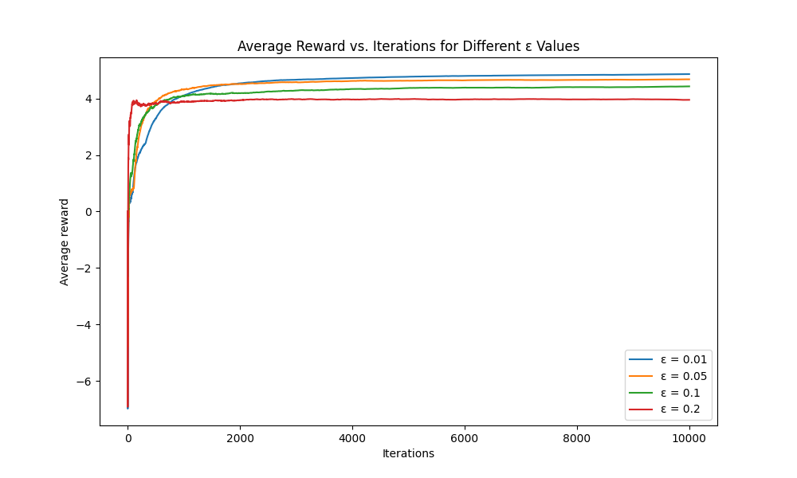

# 强化学习作业 01 多臂老虎机实验报告

## 1. 实验结果

## 2. 分析

1. 较小的ε值（如0.01）在初期学习较慢，但在大量训练后最终达到更高的平均奖励。
2. 较大的ε值（如0.2）在初期学习较快，但长期来看无法达到最优解。
3. 中等的ε值（如0.05和0.1）可能在学习速度和最终性能之间取得了较好的平衡。
4. 所有曲线最终都趋于稳定，但稳定的水平有所不同，这反映了探索与利用之间的权衡。
5. 较大的ε值可能导致更大的波动，因为它们更频繁地进行随机探索。
