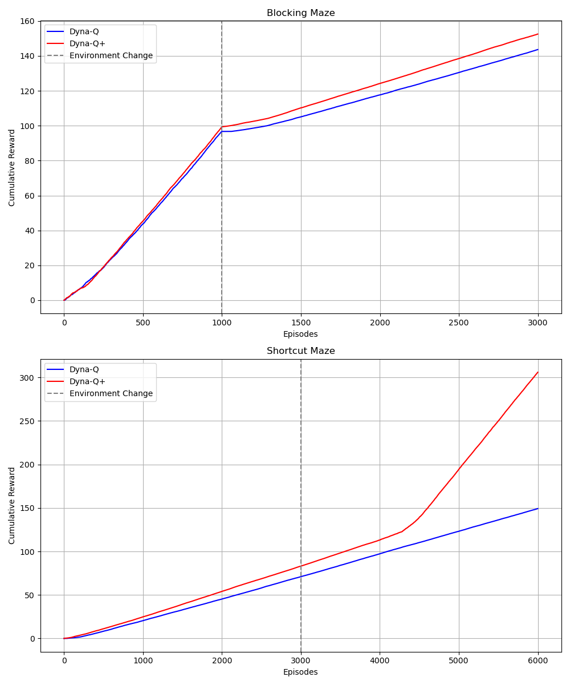

# Experiment Report

## Algorithm

### Dyna-Q

Initialize $Q(s, a)$ and $\text{Model}(s, a)$ for all $s \in \mathcal{S}$ and $a \in \mathcal{A}(s)$

Loop forever:

1. $S \leftarrow$ current (nonterminal) state
2. $A \leftarrow \epsilon\text{-greedy}(S, Q)$
3. Take action $A$; observe resultant reward $R$ and state $S'$
4. $Q(S, A) \leftarrow Q(S, A) + \alpha [R + \gamma \max_{a} Q(S', a) - Q(S, A)]$
5. $\text{Model}(S, A) \leftarrow R, S'$ (assuming deterministic environment)
6. Loop repeat $n$ times:
   - $S \leftarrow$ random previously observed state
   - $A \leftarrow$ random action previously taken in $S$
   - $R, S' \leftarrow \text{Model}(S, A)$
   - $Q(S, A) \leftarrow Q(S, A) + \alpha [R + \gamma \max_{a} Q(S', a) - Q(S, A)]$

### Dyna-Q+

Initialize $Q(s, a)$ and $\text{Model}(s, a)$ for all $s \in \mathcal{S}$ and $a \in \mathcal{A}(s)$

Loop forever:

1. $S \leftarrow$ current (nonterminal) state
2. $A \leftarrow \epsilon\text{-greedy}(S, Q)$
3. Take action $A$; observe resultant reward $R$ and state $S'$
4. $Q(S, A) \leftarrow Q(S, A) + \alpha [R + \gamma \max_{a} Q(S', a) - Q(S, A)+ \mathbf{\kappa \sqrt{t - \textbf{Model}(S, A).last\_visited\_time}}]$
5. $\text{Model}(S, A) \leftarrow R, S'$ (assuming deterministic environment)
6. Loop repeat $n$ times
   - $S \leftarrow$ random previously observed state
   - $A \leftarrow$ random action previously taken in $S$
   - $R, S' \leftarrow \text{Model}(S, A)$
   - $Q(S, A) \leftarrow Q(S, A) + \alpha [R + \gamma \max_{a} Q(S', a) - Q(S, A) + \mathbf{\kappa \sqrt{t - \textbf{Model}(S, A).last\_visited\_time}}]$

## Experiment Setup

### Parameters

- $\epsilon = 0.1$, the probability of exploration
- $\alpha = 0.0009$, the learning rate
- $\gamma = 0.8$, the discount factor
- $\kappa = 0.0001$, the Dyna-Q+ bonus parameter, reward bonus for distant actions
- $n = 50$, the number of planning steps per real step

### Maze

```
Maze 1: a easy maze
000S00000
000000000
000000000
111111110
000000000
00000000G

Maze 2: a hard maze
000S00000
000000000
000000000
011111111
000000000
00000000G

Maze 3: a shortcut maze (compared with the hard maze)
000S00000
000000000
000000000
011111110
000000000
00000000G
```

### Environment Switch

- For the Blocking Maze task, the environment switch is from the easy maze to the hard maze at episode 1000.
- For the Shortcut Maze task, the environment switch is from the hard maze to the shortcut maze at episode 3000.

## Experiment Results



## Experiment Analysis

### Blocking Maze

1. Initial Performance: In both algorithms, the performance is similar.

2. Adaptation to Changes: After the environment switch at step 1000 (Blocking Maze), although it appears that Dyna-Q+ converges faster to the optimal policy, both algorithms can find the new optimal path in the end.

3. Long-term Efficiency: At the end of the experiment, both algorithms can find the optimal path.

### Shortcut Maze

1. Initial Performance: In both algorithms, the performance is similar before the environment switch. But our experiment does not show the performance should narrow a little bit before the environment switch, that might be because the environment switch is too early before the side effect of the exploration bonus of Dyna-Q+ is shown.

2. Adaptation to Changes: After the environment switch at step 3000 (Shortcut Maze), Dyna-Q+ converges after several episodes of training. However, Dyna-Q does not converge, because he is stuck to the old optimal path and no nudges from the exploration bonus.

3. Long-term Efficiency: At the end of the experiment, only Dyna-Q+ can find the optimal path.
