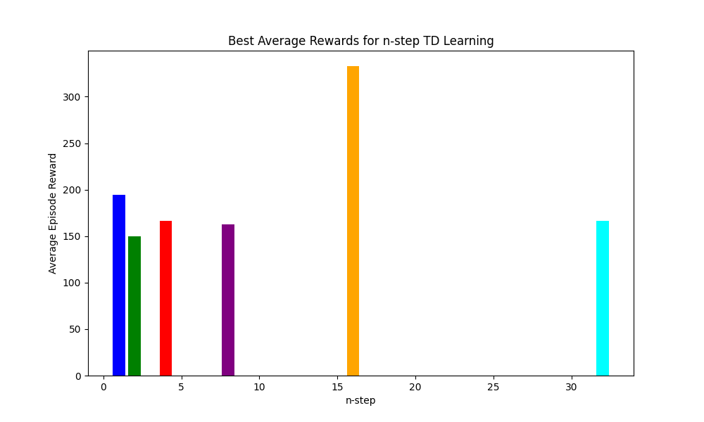

# Experiment Report

## Implementation

I use two buffers to store the current trajectory and all the trajectories.

For the first buffer, I simply use a list to store the current trajectory, for each step, I append the current state, action, reward and next state to the buffer.

For the second buffer, I use a deque with fixed length to store all the trajectories. For each trajectory and each step, I append the current state, action, reward and next state to the buffer. Once the trajectory is full, I append it to the buffer.

So there are two transitions:

1. From each step, the state, action, reward and next state are stored in the current trajectory.
2. When the trajectory is full, it is stored in the trajectory buffer.

```python
class NStepQLearner(QLearner):
    def __init__(self, config: Dict, n: int):
        super().__init__(config)
        self.n = n
        self.trajectory_buffer = deque(maxlen=self.buffer_size)  # Buffer to store multiple trajectories
        self.current_trajectory = []  # Buffer for the current trajectory

    def pair_add_to_trajectory(self, data):
        self.current_trajectory.append(data)
            
    def trajectory_add_to_buffer(self, clear=True):
        self.trajectory_buffer.append(self.current_trajectory)
        if clear:
            self.current_trajectory = []
        if len(self.trajectory_buffer) >= self.buffer_size:
            while len(self.trajectory_buffer) >= self.buffer_size:
                self.trajectory_buffer.popleft()
```

As we have the trajectory buffer, we can update the Q-value from the trajectory buffer. In the mean time, the selected trajectory is removed from the buffer so that they will never be selected again.

```python
def update_q_from_batch(self):
    if len(self.trajectory_buffer) >= self.batch_size:
        batch = random.sample(self.trajectory_buffer, self.batch_size)
        for trajectory in batch:
            T = len(trajectory)
            for t in range(T):
                if t + self.n < T:
                    G = sum(self.gamma**(i-t-1) * trajectory[i][2] for i in range(t, t+self.n))
                    G += self.gamma**self.n * self.q[trajectory[t+self.n][0]].max()
                else:
                    G = sum(self.gamma**(i-t-1) * trajectory[i][2] for i in range(t, T))
                state, action, _, _ = trajectory[t]
                self.q[state][action] += self.lr * (G - self.q[state][action])
        for trajectory in batch:
            self.trajectory_buffer.remove(trajectory)
```

We combine all these functions into the `train` function.

It is noticed that we shouldn't only add the current trajectory to the buffer when the trajectory is completed. Because if so, we can't learn from the trajectory that is not completed which may cause bad learning performance when `n` is big.

```python
def train(self):
    total_step = 0
    for i in tqdm.trange(self.start_iter, self.iter, desc=f'Training with n={self.n}'):
        state = self.env.reset()
        done = False
        while not done:
            total_step += 1
            action = self.epsilon_greedy(state)
            self.epsilon_decay(total_step)
            next_state, reward, done, truncated, _ = self.env.step(action)
            if self.render:
                self.env.render()
            if done:
                reward = self.end_reward
            self.pair_add_to_trajectory((state, action, reward, next_state))
            self.trajectory_add_to_buffer(clear=False)
            self.update_q_from_batch()
            self.epsilon_decay(total_step)
            self.lr_decay(total_step)
            self.save_model(i)
            state = next_state
        self.trajectory_add_to_buffer(clear=True)
```

In the runtime, we use several `n` to train the agent and compare the performance.

For each `n`, I train the agent for 5 times and test it for 10 times. Finally, I report the best average reward.

## Experiment Result

The `QLearner` is the Q-learning algorithm without the trajectory buffer, as the baseline:

```bash
python discrete_cartpole.py

950.npy loaded
Average Episode Reward over 10 episodes: 127.3
```

The `NStepQLearner` is the n-step Q-learning algorithm with the trajectory buffer.



1. Performance Variation: The average reward changes a lot with different n-step values. This shows that the choice of n can greatly affect learning.
2. Optimal n-step: A specific n-step value (around 15) gives the highest average reward, suggesting it might be the best for this setup.
3. Smaller n-step Values: Lower n-step values (e.g., 0, 5) show moderate performance, meaning they work but might not use the n-step method fully.
4. Larger n-step Values: As n gets bigger, performance drops, likely due to increased complexity and variance.
5. Trade-offs: Smaller n values may have higher bias, while larger n values can have more variance.

# Supplementary materials:

Furthermore, the training time is also affected by `n`. When `n` is big, the training time is longer because more steps are needed to update the Q-value, as shown in the following log:

```bash
python discrete_cartpole.py
Training for n=1 over 5 runs...
  Run 1/5 for n=1
Training with n=1: [00:22<00:00, 45.18it/s]
    Run 1 Average Episode Reward: 194.7
  Run 2/5 for n=1
Training with n=1: [00:20<00:00, 48.83it/s]
    Run 2 Average Episode Reward: 132.1
  Run 3/5 for n=1
Training with n=1: [00:20<00:00, 48.40it/s]
    Run 3 Average Episode Reward: 68.0
  Run 4/5 for n=1
Training with n=1: [00:19<00:00, 50.79it/s]
    Run 4 Average Episode Reward: 156.4
  Run 5/5 for n=1
Training with n=1: [00:21<00:00, 47.51it/s]
    Run 5 Average Episode Reward: 118.8
  Best run for n=1 is run 1 with average reward 194.7

Training for n=2 over 5 runs...
  Run 1/5 for n=2
Training with n=2: [00:15<00:00, 65.75it/s]
    Run 1 Average Episode Reward: 31.7
  Run 2/5 for n=2
Training with n=2: [00:15<00:00, 62.82it/s]
    Run 2 Average Episode Reward: 115.3
  Run 3/5 for n=2
Training with n=2: [00:17<00:00, 56.42it/s]
    Run 3 Average Episode Reward: 27.3
  Run 4/5 for n=2
Training with n=2: [00:19<00:00, 51.30it/s]
    Run 4 Average Episode Reward: 91.1
  Run 5/5 for n=2
Training with n=2: [00:15<00:00, 65.49it/s]
    Run 5 Average Episode Reward: 149.7
  Best run for n=2 is run 5 with average reward 149.7

Training for n=4 over 5 runs...
  Run 1/5 for n=4
Training with n=4: [00:16<00:00, 60.02it/s]
    Run 1 Average Episode Reward: 67.4
  Run 2/5 for n=4
Training with n=4: [00:17<00:00, 57.01it/s]
    Run 2 Average Episode Reward: 105.6
  Run 3/5 for n=4
Training with n=4: [00:13<00:00, 76.31it/s]
    Run 3 Average Episode Reward: 90.1
  Run 4/5 for n=4
Training with n=4: [00:17<00:00, 58.65it/s]
    Run 4 Average Episode Reward: 151.0
  Run 5/5 for n=4
Training with n=4: [00:13<00:00, 73.10it/s]
    Run 5 Average Episode Reward: 166.6
  Best run for n=4 is run 5 with average reward 166.6

Training for n=8 over 5 runs...
  Run 1/5 for n=8
Training with n=8: [00:22<00:00, 44.29it/s]
    Run 1 Average Episode Reward: 162.7
  Run 2/5 for n=8
Training with n=8: [00:18<00:00, 53.72it/s]
    Run 2 Average Episode Reward: 136.6
  Run 3/5 for n=8
Training with n=8: [00:18<00:00, 54.49it/s]
    Run 3 Average Episode Reward: 92.9
  Run 4/5 for n=8
Training with n=8: [00:21<00:00, 46.19it/s]
    Run 4 Average Episode Reward: 49.8
  Run 5/5 for n=8
Training with n=8: [00:17<00:00, 55.67it/s]
    Run 5 Average Episode Reward: 125.2
  Best run for n=8 is run 1 with average reward 162.7

Training for n=16 over 5 runs...
  Run 1/5 for n=16
Training with n=16: [00:22<00:00, 45.33it/s]
    Run 1 Average Episode Reward: 281.5
  Run 2/5 for n=16
Training with n=16: [00:27<00:00, 36.93it/s]
    Run 2 Average Episode Reward: 332.9
  Run 3/5 for n=16
Training with n=16: [00:26<00:00, 38.39it/s]
    Run 3 Average Episode Reward: 85.3
  Run 4/5 for n=16
Training with n=16: [00:24<00:00, 40.65it/s]
    Run 4 Average Episode Reward: 132.8
  Run 5/5 for n=16
Training with n=16: [00:22<00:00, 43.75it/s]
    Run 5 Average Episode Reward: 115.0
  Best run for n=16 is run 2 with average reward 332.9

Training for n=32 over 5 runs...
  Run 1/5 for n=32
Training with n=32: [00:29<00:00, 33.94it/s]
    Run 1 Average Episode Reward: 42.4
  Run 2/5 for n=32
Training with n=32: [00:37<00:00, 26.51it/s]
    Run 2 Average Episode Reward: 63.2
  Run 3/5 for n=32
Training with n=32: [00:31<00:00, 31.55it/s]
    Run 3 Average Episode Reward: 166.5
  Run 4/5 for n=32
Training with n=32: [00:29<00:00, 33.43it/s]
    Run 4 Average Episode Reward: 49.6
  Run 5/5 for n=32
Training with n=32: [00:31<00:00, 31.33it/s]
    Run 5 Average Episode Reward: 28.8
  Best run for n=32 is run 3 with average reward 166.5
```